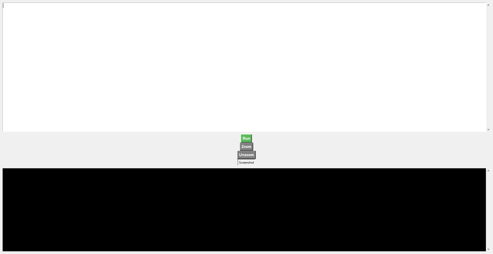
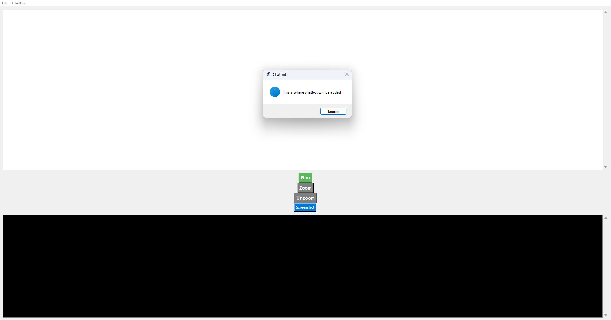

# Python Code Editor and Terminal Environment

This project provides two different interfaces for an interactive code editor in Python:

- `tkinter_editor.py`: A GUI-based Python code editor with button interactions.
- `terminal_coding.py`: A terminal-based, minimalist but efficient development environment.

## Features

### `tkinter_editor.py`

- Code writing and execution
- File open, save, and create new file functionalities
- Auto-completion for parentheses and quotation marks
- **Immediate display of code output in the bottom window**
- Screenshot capture functionality (`Screenshot` button)
- Chatbot interaction feature (currently in the process of development)

### `terminal_coding.py`

- Code writing and execution via the terminal
- A simpler experience for those who prefer minimalism

## Chatbot

The `tkinter_editor.py` includes a chatbot button. It's currently just a demo and will be further developed in upcoming updates.

## Screenshots

| Interface Overview | Code Example | Chatbot Interaction |
|--------------------|--------------|---------------------|
|  |  |  |

## Installation

```bash
pip install pillow, tkinter
python tkinter_editor.py
```

## Contributing

If you'd like to contribute to the project, feel free to send a pull request or open an issue. Any suggestions are welcome!